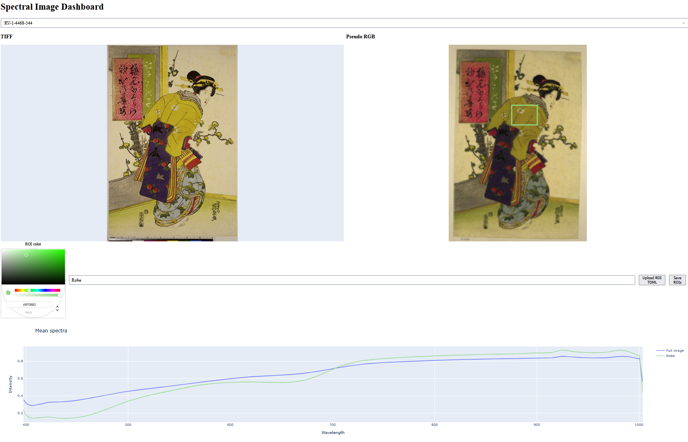

```{python}
#| eval: false

from fairdatanow import data_now
from hyperviz import make_dashboard

url = 'https://laboppad.nl/ukiyo-e-world' 

toml_txt = """
[data.npz]
RV-1-4468-544 = ".*RIS/interim/.*RV-1-4468-544.*[.]npz"
RV-1-4469-484 = ".*RIS/interim/.*RV-1-4469-484.*[.]npz"
RV-1-4469-58 = ".*RIS/interim/.*RV-1-4469-58.*[.]npz"
RV-1-4469-x6 = ".*RIS/interim/.*RV-1-4469-x6.*[.]npz"
RV-1-4469Q = ".*RIS/interim/.*RV-1-4469Q.*[.]npz"
RV-1-4470-12 = ".*RIS/interim/.*RV-1-4470-12.*[.]npz"
RV-1-4470-27 = ".*RIS/interim/.*RV-1-4470-27.*[.]npz"
RV-360-2345g = ".*RIS/interim/.*RV-360-2345g.*[.]npz"
RV-360-2359-2 = ".*RIS/interim/.*RV-360-2359-2.*[.]npz"
RV-360-6886 = ".*RIS/interim/.*RV-360-6886.*[.]npz"

[data.tif]
RV-1-4468-544 = ".*akama.*RV-1-4468-544[.]tif"
RV-1-4469-484 = ".*akama.*RV-1-4469-484[.]tif"
RV-1-4469-58 = ".*akama.*RV-1-4469-58[.]tif"
RV-1-4469-x6 = ".*akama.*RV-1-4469-x6[.]tif"
RV-1-4469Q = ".*akama.*RV-1-4469Q[.]tif"
RV-1-4470-12 = ".*akama.*RV-1-4470-12[.]tif"
RV-1-4470-27 = ".*akama.*1-4470-27[.]tif"
RV-360-2345g = ".*akama.*RV-360-2345-?g[.]tif"
RV-360-2359-2 = ".*akama.*RV-360-2359-2[.]tif"
RV-360-6886 = ".*akama.*RV-360-6886[.]tif"
"""

data = data_now(url, toml_txt)
make_dashboard(data, toml_txt)
```


